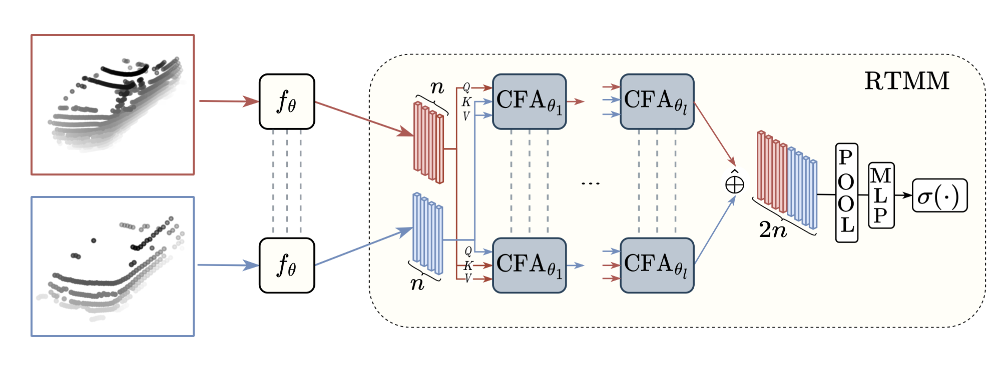

# Object Re-identification from Point Clouds (code and Models coming soon!)

[**website**](https://github.com/bentherien/point-cloud-reid) | [**paper**](https://arxiv.org/abs/2305.10210) | [**dataset**](https://github.com/bentherien/point-cloud-reid)




# Abstract
Object re-identification (ReID) from images plays a critical role in application domains of image retrieval (surveillance, retail analytics, etc.) and multi-object tracking (autonomous driving, robotics, etc.). However, systems that additionally or exclusively perceive the world from depth sensors are becoming more commonplace without any corresponding methods for object ReID. In this work, we fill the gap by providing the first large-scale study of object ReID from point clouds and establishing its performance relative to image ReID. To enable such a study, we create two large-scale ReID datasets with paired image and LiDAR observations and propose a lightweight matching head that can be concatenated to any set or sequence processing backbone (e.g., PointNet or ViT), creating a family of comparable object ReID networks for both modalities. Run in Siamese style, our proposed point cloud ReID networks can make thousands of pairwise comparisons in real-time ($10$ Hz). Our findings demonstrate that their performance increases with higher sensor resolution and approaches that of image ReID when observations are sufficiently dense. Our strongest network trained at the largest scale achieves ReID accuracy exceeding $90\%$ for rigid objects and $85\%$ for deformable objects (without any explicit skeleton normalization). To our knowledge, we are the first to study object re-identification from real point cloud observations.


## Usage
### Downloading our nuscenes reid dataset

Run the following command to download our reid dataset in compressed form:

```bash
mkdir data
cd data
mkdir lstk
cd lstk
wget wiselab.uwaterloo.ca/reid/compressed_datasets/nuscenes-reid-dataset.tar.gz
wget wiselab.uwaterloo.ca/reid/compressed_datasets/sample_token_to_num.pkl
wget wiselab.uwaterloo.ca/reid/compressed_datasets/instance_token_to_id.pkl
wget wiselab.uwaterloo.ca/reid/compressed_datasets/instance_to_keyframes.pkl
wget wiselab.uwaterloo.ca/reid/compressed_datasets/ds_name_to_scene_token.pkl
wget wiselab.uwaterloo.ca/reid/compressed_datasets/sample_to_keyframes.pkl
```

After downloading the dataset, extract it to the `data` directory:

```bash
pigz -dc nuscenes-reid-dataset.tar.gz | tar -xf - -C /path/to/data
```

`ls data` should now show the following:
```
lstk
```
`ls data/lstk` should now show the following:
```
ds_name_to_scene_token.pkl  instance_to_keyframes.pkl  sample_to_keyframes.pkl
instance_token_to_id.pkl    sample_token_to_num.pkl    sparse-trainval-det-both nuscenes-reid-dataset.tar.gz
```

### Downloading our pre-trained models

Run the following command to download our pre-trained models:

```bash
./tools/download_pretrained.sh
```

### Environment Setup
We have always used docker containers during development. Therefore, we recommend you do the same.
```bash
docker pull benjamintherien/dev:bevfusion_base-pt3d-pyg-o3d-waymo
```
After downloading our docker image, run the container. You can use the following python script, filling in your own values where needed:
```bash
python docker/run_docker.py
```
Outside of the container, at the same level as your clone of this repository clone the lamtk repository:
```bash
git clone https://github.com/c7huang/lamtk
```
Then, inside the container, run the following commands to install the lamtk package and other dependencies:
```bash
./script_new_install.sh
```
Finally, during development and evaluation, we have always used neptune to log our runs. Based on our limited testing, diabling neptune logging causes errors that we have not yet debugged. Until we remove this dependency in the code you will need specify your neptune project and api Key in the following configuration files:
```bash
configs_reid/_base_/reidentification_runtime_testing.py
configs_reid/_base_/reidentification_runtime.py
```

### Evaluation

We also provide instructions for evaluating our pretrained models. Assuming you have downloaded oour pre-trained models, you can run the following command to evaluate our models on the nuScenes reid dataset!

Here is a command to evaluate point-transformer trained for 4000 epochs, our strongest point model on nuScenes ReID:

```bash
CUDA_VISIBLE_DEVICES=0 MASTER_ADDR=localhost torchpack dist-run -v -np 2 python tools/train.py configs_reid/reid_nuscenes_pts/testing_pts_point-transformer_r_nus_det_500e.py --checkpoint pretrained/nuscenes/pts_point-transformer_r_nus_det_4000e.pth
```
The number of GPUs can be changed by changing the -np flag. For example, to run on a two GPUs, run the following command:
```bash
CUDA_VISIBLE_DEVICES=0,1,2,3 MASTER_ADDR=localhost torchpack dist-run -v -np 4 python tools/train.py configs_reid/reid_nuscenes_pts/testing_pts_point-transformer_r_nus_det_500e.py --checkpoint pretrained/nuscenes/pts_point-transformer_r_nus_det_4000e.pth
```

For simple evaluation of all models, one can use `launching_testing.py`, which is easily customizable to test any of our pre-trained models.

### Training

We provide instructions to reproduce our trained models on nuScenes ReID. For instance, to train DGCNN on nuScenes ReID, run the following command:

```bash
CUDA_VISIBLE_DEVICES=0 MASTER_ADDR=localhost torchpack dist-run -v -np 1 python tools/train.py configs_reid/reid_nuscenes_pts/pts_dgcnn_point-cat_nus_det_4x256_500e.py --seed 66
```
To train DeIT base on nuScenes ReID, run the following command:
```bash
CUDA_VISIBLE_DEVICES=0,1,2,3 MASTER_ADDR=localhost torchpack dist-run -v -np 4 python tools/train.py configs_reid/reid_nuscenes_image/rgb_deit-base_point-cat_pt_nus_det_4x60_200e.py --seed 66
```

For simple training of all modes, one can use `launching_training.py`, which is easily customizable to train any of our models.

## Acknowledgements

Our repository is based on [lamtk](https://github.com/c7huang/lamtk),[bevfusion](https://github.com/mit-han-lab/bevfusion), and [mmdetection3d](https://github.com/open-mmlab/mmdetection3d)


## Citing
If you find our work useful, please consider citing:
```BibTeX
@article{therien2024pcreid,
  author    = {Therien, Benjamin 
               and Huang, Chenjie 
               and Chow, Adrian
               and Czarnecki, Krzysztof},
  title     = {Object Re-identification from Point Clouds},
  journal   = {WACV},
  year      = {2024},
}
```
